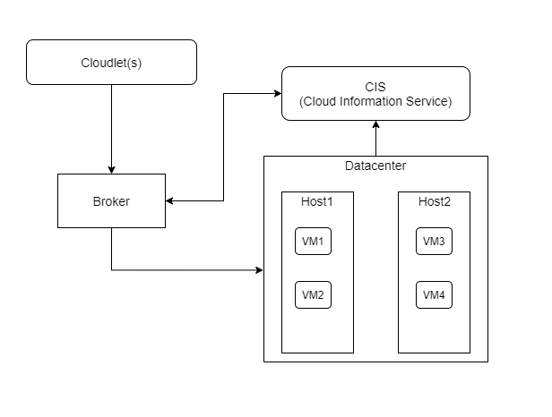

# Cloud Simulators

## Project Description 
The intention of the project is to simulate cloud computing infrastructure, execute and evaluate different cloud models with different VM allocation polices, VM scheduling policies and Cloudlet scheduling policies. The project is created using [CloudSim Plus](https://cloudsimplus.org/) framework. The framework helps mode, simulate and experiment on cloud environments with its rich libraries. This allows the developers to focus on the system design issues, without worrying about the low-level details of the cloud infrastructure. 

## Simulation Environment Architecture 

## References
1. [Rock the JVM](https://www.youtube.com/c/RocktheJVM)
2. [SuperWits Academy](https://www.youtube.com/channel/UCc0MW9_-0n7wHsX73DnfkKQ)

TODOs
1. CloudSim plus
2. Architecture
3. How simulation works
4. Project
   1. Files
   2. Simulations
5. How to execute
